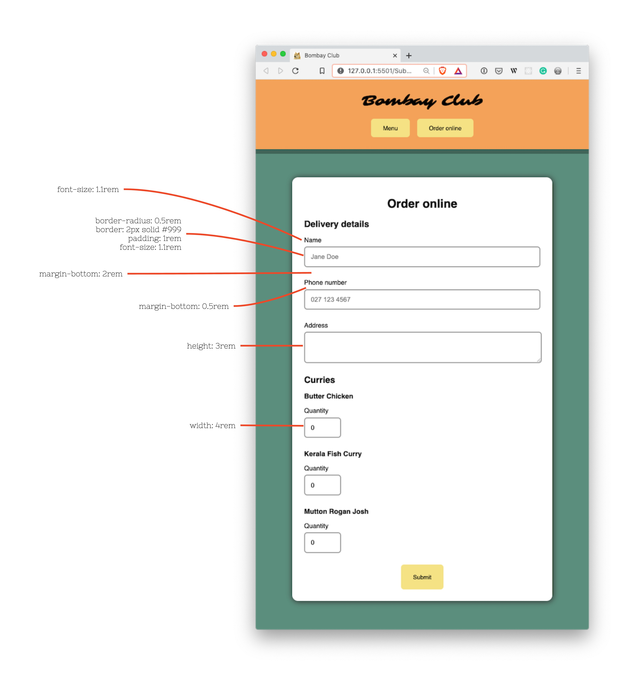

# 01 Exercise - CSS form design

Apply design principals to an HTML form using CSS

---

## Brief

The Bombay Club curry house has a web page, but no way to make orders online. You need to build a form, make sure it has a usable design, and make it send an email when the form is submitted. You will need to think about design principals, for example, hierarchy and white space.

    
Form design specification

---

## Rationale

The default browser form design makes them very hard to use. By improving the design, customers are more likely to fill out your form.

---

## Getting Started

1. `clone` the exercise repository to your local computer using VS Code or the Terminal.
2. The code for this exercise should go into `/Submission/static/css/style.css`.

---

## Part A - Write the form HTML

Write the HTML for the form, by referencing the design specification.

**Acceptance criteria**

- All the form elements from the specification are displayed on the page
- When clicking the label element, the corresponding input is focused
- The form submits to the provided action in the `<form>` element
- The HTML has no errors when validated in the [W3C Validator](https://validator.w3.org/#validate_by_input)

## Part B - Design the form

The HTML form you have built has no CSS design applied to it. It's small and hard to use on a mobile device.

1. Open your CSS file, and scroll to the very bottom. This is where you will be adding your CSS style.
2. Design your form using CSS so it matches the specification in the brief. You may need to add extra elements or class attributes to your HTML.
3. You will need to figure out how to change the layout to match. For example, you might use flexbox to make the form inputs stretch across the page.
4. Commit your code to git

**Acceptance criteria**

- The page design matches the specification from the brief
- The form elements stretch to match the width of the container element.

## Part C - Give the form an action

1. You should have a FormSpree account from the previous exercise. If you don't, [register for a FormSpree account](https://formspree.io/register)
2. In FormSpree, create a new form. Call it _Bombay Club Order Form_
3. Update the `<form>` element to use the example provided by FormSpree. It should update the action attribute on the `<form>`.
4. Test your form by making an order. You should have received an email detailing what you ordered.
5. Commit your code to git.

**Acceptance criteria**

- When the form is submitted, an email is sent via FormSpree

## OPTIONAL Part D - More design improvements

📔 **Note:** this part is optional. There is no requirement to complete it.

1. The form specification makes improvements to the form, but there are probably more improvements that could be made.
2. Using your design knowledge, make your own improvements to the form. Look for inspiration from other websites.
3. Ensure the form looks good on mobile devices, tablets, and desktop browsers.
4. Commit your code to git.

---

# Submit your Exercise

- [ ] Push your code to GitHub by typing `git push`
- [ ] "Mark as done" in Google Classroom

---

## Exercise answer walkthrough

- [Walkthrough of HTML design exercise](https://www.loom.com/share/98a5baee1eef4b358c0a390d7223b4bc)

